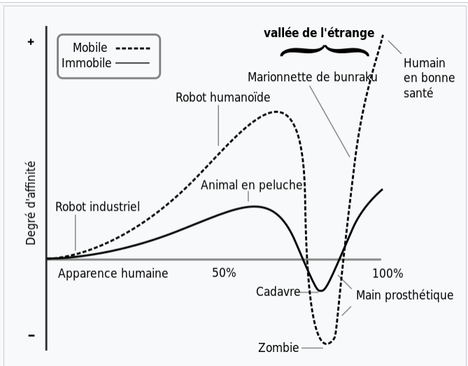
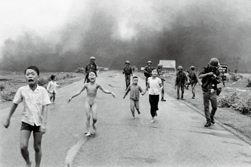
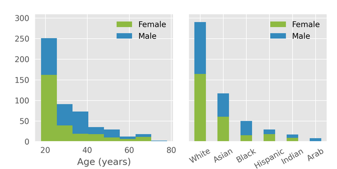

## Enjeux esthétiques et quête du réalisme

L'apparition des images de synthèse dans le cinéma depuis deux décennies, et celle des visages synthétiques en particulier, ouvre un champ de réflexion sur la nature de l'art numérique, le statut artistique des images numériques et leur rapport au monde et à nous même. Selon S. Solé, ces technologies "ne remettent pas en question fondamentalement la place de l'homme et du visage dans le cinéma. Le cinéma n'a pas attendu les technologies numériques pour défigurer le visage, pour l'effacer, pour le gommer, pour le transformer. De ce point de vue-là, il n'y a pas grand-chose qui change, d'autant plus que les films où les visages ou les comédiens sont numériquement remplacés sont quand même assez peu nombreux. Ils ont une grande place dans le paysage, parce qu'il s'agit souvent de films hollywoodiens."

La question du réalisme est souvent la première que l'on se pose à propos des visages synthétiques. Sont-ils réalistes ? Peuvent-ils transmettre une émotion ? Pourquoi éprouve-t-on parfois un sentiment de gêne ? En nous plaçant dans la perspective sémiotique de la philosophie de Pierce et de la lingusitique de Saussure, le réel pour la sémiotique est toujours une question de construction, de médiation, de comparaison : c'est un effet déterminé par un acte d'interprétation d'un objet donné auquel nous sommes confrontés. Ainsi, comme l'analyse G. Giuliana, "le réalisme est un *effet de réalité* qui découle des structures sémiotiques (mêlant le culturel et le cognitif) que nous utilisons pour appréhender et donner un sens à la réalité en termes d'attribution de sens et d'identité par le biais de *critères interprétatifs de réalité appliqués en contexte et dérivés de nos habitudes*"[^1]. Il s'agit donc de prendre quels "effets de réalité" nous perçevont ou non dans les visages synthétiques. 

Dans cet article publié en 2022, G. Giuliana est parti d'une analyse technique de la base de données de MetaHuman Creator, l'outil de création de personnages numériques d'Epic Games, sorti en 2021. Il a montré que la haute précision mathématique entrainée par IA permet une précision mathématique et géométrique sans précédent des détails, imitation de muscles, animation des expressions et textures des visages, ce qui entraine un "hyper-iconisme" des visages synthétiques. Pour rappel, la théorie sémiotique de Charles Sanders Peirce distingue trois types de signes : les signes iconiques sont les images qui ont une relation de une ressemblance avec leur modèle (le dessin d'une chaise); le signe symbolique entretient une relation purement conventionnelle avec l'objet (le langage); le signe indiciel est produit par son référent (l'empreinte de pas). Ce qui nous intéresse ici est la relation entre impression de réalisme et indice. Historiquement, les technologies jugées les plus réalistes sont celles qui établissent (ou nous laissent croire à) une relation indicielle, en particulier la photographie, considérée comme un indice iconique (indice physique par le biais de la lumière). Selon Leslie (2004)[^2] en effet, moins nous ferons une distinction substancielle entre réalité et représentation, plus l'impact sur les processus neuro-socio-cognitifs nous permettra de "lire" le visage, de le croire humain et de lui faire confiance. A la précision mathématique et géométrique, s'ajoutent selon G. Giuliana, l'immensité de la base de données (potentiellement extensible à l'infini) qui créé des "types" (abstraits et uniques), qui sont au coeur du processus d'identification et de l'impression de familiarité; puis la très haute densité d'informations qui donne la matérialité des visages et créé des "jetons" ("tokens", concrets et particuliers); enfin les variations possibles de la base de données (expressions faciales, vieillissement, modifications des textures, etc) fournissent deux aspects fondamentaux aux visages : la temporalité et la possibilité, ce qui augmente la complexité de la lecture en empêchant de les réduire à une seule dimension.

Certains visages éveillent pourtant chez nous une forme de malaise. On désigne ce phénomène par la notion de « vallée de l’étrange » (*Uncanny Valley*), inventée dans les années 1970 par le roboticien Masahiro Mori, tiré de "l'inquiétante étrangeté" de S. Freud (*Das Unheimliche*) qui désigne le fait que, lorsqu’un objet atteint un certain degré de ressemblance anthropomorphique apparaît une sensation d’angoisse et de malaise. Selon Masahiro (2012)[^3], les nombreux effets troublants des visages artificiels proviennent d'objets-visages qui sont suffisamment détaillés pour déclencher une forme type de connaissance des visages, mais qui ne sont cependant pas assez précis pour être lus comme de véritables "jetons" (*tokens*). Il s'agirait donc qu'une quantité, qualité et détails de l'information numérique non suffisante, provoquant un entre-deux, une dissonance cognitive qui nous met mal à l'aise. Cela permettrait d'expliquer le fait que nous ayons plus d'empathie pour des dessins animés qui assument l'absence de photoréalisme que pour certaines tentatives ratées de réalisme numérique (voir *Cats*, par exemple). 

Bien que le réalisme soit un paradigme pour beaucoup dans l'imagerie synthétique, certains sont critiques envers cette attente de réalisme, comme S. Solé: "Le problème, ce n'est pas tellement que ces visages sont de plus en plus réalistes, c'est qu'on soit en tant que spectateur dans une idéologie du réalisme. On attend des images qui correspondent à un certain type d'agencement visuel, d'esthétique, qui est déterminé par des critères photo-réalistes. Mais que le visage soit réaliste ou non, ce n'est pas un problème, c'est une option esthétique. Et là, tout est déterminé par la quête de la vraisemblance et de la fidélité. C'est ce qu'un informaticien, John Walker, appelle l'idéologie mimétique. C'est le fait que toute la production visuelle, en tout cas la plus massive, soit orientée vers cet unique but qui est de se confondre avec l'image du réel. Et cette image du réel qu'on cherche à atteindre, est déjà idéologiquement construite par des appareils optiques comme la caméra ou l'appareil photo. On va chercher à imiter un type d'image qui nous semble être la copie conforme du réel, alors que cette copie est déjà construite technologiquement et idéologiquement. Ne serait-ce que par la perspective. Un appareil photographique organise le monde en fonction d'un point de vue qui est celui du regard humain et qui est déterminé par un point dans l'espace et des lignes de fuite qui convergent. On pourrait très bien imaginer des modes de vision, où ça ne serait pas le cas."

Le débat autour de la définition, de l'essence et de l'objectif de l'art numérique tient à l'absence de contours bien définis. Les théoriciens de l'art s'interrogent encore, comme S. Solé: "Généralement, les arts arrivent à trouver leur autonomie en se détachant du réel, et en parvenant à trouver ce qui constitue leur distinction première dans leur médium. Le problème, c'est que pour l'imagerie numérique, je ne sais pas. Je pourrais pas dire exactement ce qui fait la distinction de ce médium comparé à tous les autres médiums. Je ne sais pas ce qui les distingue, en fait. Le problème de l'imagerie numérique, c'est que c'est un médium qui est ultra polymorphe et caméléon. Il peut prendre l'apparence de n'importe quel autre type de médium. Une image numérique peut se faire passer pour une peinture, pour une sculpture, pour une photographie... Mais derrière toutes ces masses, à quoi correspondent réellement les images numériques ? Qu'est-ce qui fait leur qualité première distinctive ? Je ne sais pas."

[^1]: Giuliana, G.T. What is So Special About Contemporary CG Faces? Semiotics of MetaHumans. Topoi 41, 821–834 (2022). https://doi.org/10.1007/s11245-022-09814-0
[^2]: Leslie KR, Johnson-Frey SH, Grafton ST (2004) Functional imaging of face and hand imitation: towards a motor theory of empathy. Neuroimage 21(2):601–607
[^3]: Masahiro M, MacDorman K, Norri K (2012) The uncanny valley [from the field]. IEEE Robot Autom Mag 19:98–100

## Implications éthiques et politiques 

La représentation de l'être humain, et du visage en particulier, a toujours dit quelque chose de notre rapport au monde et à nous-mêmes. Bien que le genre du portrait n'existe plus vraiment en tant que catégorie, la création de visages synthétiques, sans référent, dit peut être quelque chose de l'individu du XXIe siècle. C'est l'hypothèse de S. Solé: "Peut-être qu'il faut voir dans ces visages sans modèle une certaine expression de la tendance de l'individu du XXIe siècle non pas à se tourner vers le passé et à s'ancrer dans ses origines, qu'elles soient ancestrales, celles des parents, mais plutôt à la tendance de se tourner vers l'avenir, à ce que l'on pourrait être, plutôt que ce que l'on a été. Et à la tendance à se construire soi-même comme individu dont on est le créateur. C'est ce que Sloterdijk appelle dans un livre qui s'appelle *Après nous le déluge* la "tendance du bâtard autogène". C'est-à-dire une tendance qui consiste à renier, ou en tout cas à faire fi de notre passé, de ce qui nous constitue dans le passé, pour plutôt s'autodéterminer et s'autogénérer avec des critères que l'on détermine."

La question du visage pose aussi une question éthique. Dans *Ethique et Infini*, Levinas définit la morale comme un absolu qui régit toute existence avec rigueur et qui oriente la relation à autrui, nommée responsabilité-pour-autrui. L’expérience d’autrui est donc prépondérante, et celle-ci dans le visage, qui excède toute description possible. Lévinas décrit le visage comme une vulnérabilité absolue, “mais cette supplication est une exigence” de soutien et d’aide. “Le visage s’impose à moi sans que je puisse cesser d’être responsable de sa misère. La conscience perd sa première place”.

*David Burnett. Petite fille brûlée au Napalm. 1972*

Comment ne pas sentir sa responsabilité-pour-autrui en voyant la détresse infinie dans les yeux de ces petites filles brûlées par les armes chimiques américaines au Vietnam ? Cette photo a d’ailleurs grandement participé à un retournement de l’opinion publique américaine et dans le monde en faveur de la fin de la guerre au Vietnam. Le visage a quelque chose de transcendant, qui selon Lévinas renvoie à un trait d’humanité essentiel qui fonde le sujet, et à l’injonction “Tu ne tueras point”.

La subjectivité du visage investit une responsabilité totale, le visage d’autrui peut incarner une responsabilité morale, et appelle une réponse si ce dernier est en détresse. Mais quand un visage peut être construit par une machine à calculer, l’image d’un visage serait à manipuler avec plus de prudence. Les techniques de synthétisation du visage humain par intelligence artificielle instille un doute, qui bouleverse notre rapport symbolique et moral aux images. 

Pourtant, la responsabilité qu'on éprouve à l'égard d'un visage n'est pas tant lié au réalisme, comme nous l'avons souligné plus haut, nous pouvons éprouver de l'empathie pour des personnages non réalistes. Le changement vient plutôt de l'absence d'individualité humaine derrière l'image de visage, comme le confirme S. Solé : "Ces images posent un problème vis-à-vis de la philosophie de Lévinas. Le premier problème, c'est qu'elles réduisent le visage à une image, et qui plus est une image sans référent. Là où dans le cinéma il y a un référent dans le réel, là c'est un visage construit de toutes pièces. Ce qui est quand même plus ou moins une première. Après, il y a ce premier problème, la réduction du visage à une image, et dans le même temps, le visage quitte la sphère de la moralité et de l'humanité. C'est-à-dire qu'il n'est plus le lieu de l'impératif moral, « tu ne tueras point », c'est le premier reproche qu'on pourrait faire à ces images."

+ changement de la valeur de preuve associée aux images https://universiteouverte.u-cergy.fr/visage-et-mensonge-comment-lintelligence-artificielle-manipule-t-elle-les-images/ 

Pour élargir notre réflexion, la question des utilisations des bases de données et des biais possibles ouvre un vaste champ de recherche, allant de la sous-représentation des minorités dans les bases de données à la reconnaissance faciale (la base de données étudiée n'a pas vocation à ce dernier emploi). 

Pour conclure sur notre base de données, nous constatons tout de même un biais de représentativité en termes de diversité. Il y a une surreprésentativité des jeunes de 20 à 30 ans, ainsi que des personnes blanches. Selon S. Solé, "Le problème, c'est que si un créateur veut essayer de produire un visage qui soit celui d'une personne noire, indienne ou arabe, il y a plus de chances pour que ce visage ne soit pas réaliste, ou ne suscite moins d'empathie, ou ne soit pas identifié comme réaliste, parce qu'il n'y aura pas assez eu de données entrantes pour entraîner l'algorithme. En fait, ça ne fait que reproduire les biais qui existent déjà au cinéma."

*Histograms of self-reported age, gender, and ethnicity in Microsoft's "Face it until you make it" collection of 3D face scans. 2021*

Cédric Thébault confirme ce risque de biais face à la diversité: "En théorie, on pourrait viser une très grande diversité, mais cela dépend des outils utilisés pour générer ces données. Par exemple, si l'on utilise un modèle morphable qui construit lui-même une base de visages à partir de données existantes, les biais présents dans la construction initiale de cette base de visages seront également présents dans le modèle morphable résultant. Ainsi, bien que l'on puisse viser des morphologies diverses, on peut finalement être limité par les biais présents dans la construction initiale, et ne pas pouvoir exprimer toute la diversité réelle souhaitée".

Une des utilisations possibles des visages synthétiques est la contribution au deepfake, par la supperposition d'un visage synthétique sur une vidéo existente ou combinée à un audio.
"Il y a un film qui s'appelle Bienvenue en Tchétchénie, qui utilise justement les deepfakes de manière éthique, on va dire. C'est la prétention du film. En gros c'est un film sur la condition des homosexuels tchétchènes, qui sont du coup victimes de persécution. Et pour protéger les témoins, plutôt que de flouter ou d'escamoter le visage réel des personnages, ils les ont remplacés avec un deepfake, enfin plusieurs deepfakes.
Et le geste assez poétique, c'est que le visage qui vient remplacer le visage réel des témoins, c'est celui de militants LGBT américains, qui ont accepté de prêter l'image de leur visage pour couvrir et protéger les homosexuels tchétchènes qui ont accepté de témoigner dans le film."

Pour finir, nous proposons d'ouvrir vers la notion de "culture du faux"du professeur Massimo Leone.

<iframe width="1280" height="654" src="https://www.youtube.com/embed/9jjquRK2T5o" title="E-Guest Lecture : Massimo Leone - Semioethics of the Visual Fake" frameborder="0" allow="accelerometer; autoplay; clipboard-write; encrypted-media; gyroscope; picture-in-picture; web-share" allowfullscreen></iframe>

Samuel Solé complète justement notre invitation à la réflexion : "Il y a notamment ce professeur Massimo Leone, qui développe  une théorie autour de ce qu'il appelle l'idéologie du visage, et qui remonte bien sûr aux travaux de la physiognomie. Des portraits robots, des travaux d'Alphonse Bertillon, qui est le premier en gros à essayer d'établir une corrélation entre certains traits du visage et la prédisposition à certains types de crimes. Et qui aujourd'hui, sous pré-actualisé, par des biais plus scientifiques, on va dire, qui ne correspondent plus aux normes scientifiques actuelles, notamment dans les dispositifs de reconnaissance faciale, qui en fonction de certaines caractéristiques physiques vont criminaliser. Les biais sont essentiellement racialistes aujourd'hui. Mais effectivement, une personne qui va présenter certains traits physiques, et qui vont être détectés par un dispositif de reconnaissance sociale, c'est très courant dans les aéroports, va être le centre de l'attention du système de surveillance de l'aéroport. C'est couplé aussi à certains types de comportements, à certains types de vêtements, il n'y a pas que le visage qui est impliqué évidemment, mais ça s'inscrit justement dans cette idéologie du visage, qui consiste à faire du visage une surface lisible, transparente, et criminalisable, si elle répond à certains critères."

Dans un article du Monde “Les images créées par IA et le risque de réécrire l’histoire”  
“Ce type de production menace d’alimenter les croyances conspirationnistes. Un internaute a ainsi généré une série de fausses archives montrant, de manière humoristique, derrière un impeccable jaune sépia, le « premier contact [avec des extraterrestres] en 1863 ». Une aubaine pour les « chercheurs de vérité » en manque de preuves visuelles, et souvent peu regardant sur leur provenance.”

Perte de la valeur de preuve de l’image 

Bibliographie : 

https://www.cineclubdecaen.com/analyse/intelligenceartificielleaucinema.htm 

https://savoirs-archives.unistra.fr/patrimoine/lia-peut-elle-creer/patrimoinelia-peut-elle-creerlia-au-cinema-ou-le-reflet-des-craintes-scientifiques-de-notre-epoque/index.html 

https://hal.science/hal-04248804/document 

https://www.lemonde.fr/les-decodeurs/article/2023/05/11/les-images-creees-par-ia-et-le-risque-de-reecrire-l-histoire_6172920_4355770.html 

https://universiteouverte.u-cergy.fr/visage-et-mensonge-comment-lintelligence-artificielle-manipule-t-elle-les-images/
