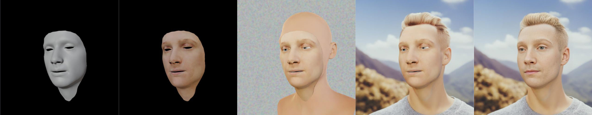

Dans les articles de Microsoft, [3D Face Reconstruction with Dense Landmarks](https://microsoft.github.io/DenseLandmarks/) et [Fake It Till You Make It](https://microsoft.github.io/FaceSynthetics/) (Eroll Wood et al.), sont illustrés de nombreux aspects techniques de la synthèse de visages. 

Ces 2 travaux sont motivés par un fait : si l'on veut faire un détecteur de repères faciaux denses en utilisant des méthodes d'apprentissage profond, il faut avoir un grand ensemble de données densément annotées, et cela ne peut pas être fait, de manière cohérente et à grande échelle, par des humains. On a donc besoin d'un jeu de données entièrement synthétique, sur lequel les points de repère faciaux seront connus par construction.

Nous disinguerons plusieurs paramètres qui composent une photo de visage : 
1. L'identité : ce sont les caractéristiques morphologique du visage propres à un individu. Par exemple : l'écart inter-oculaire, la largeur de la mâchoire, la taille des oreilles ...
2. L'expression : c'est la façon dont les muscles faciaux sont contractés de façon à déformer la morphologie pour créer un expression faciale. Par exemple : l'ouverture du la bouche, la contraction des zygomatiques, la fermetures des paupières ...
3. La texture : c'est la couleur (l'albedo), et le relief de la peau
4. La pilosité : sourcils, cheveux, barbes, moustaches ...
5. Les accessoires : les couvres-chefs, les vêtements, les bijoux, les lunettes ...
6. Le fond et les éclairages : l'arrière plan qui permet de situer un visage dans son contexte et les lumières permettant de créer une variété de situations lumineuses

Pour en synthétiser, plusieurs approches sont possibles, détaillons-les ici, de la plus "manuelle" à la plus "automatique" : 

## Généreration entièrement à la main

Cette méthode qu'on pourrait qualifier de *brute-force* consiste à créer manuellement des variations pour chaque paramètre ci-dessus. Typiquement, cela signifie de créer des centaines d'identités différentes, des centaines d'expressions ... Cette méthode est en pratique très peu utilisé car ne pouvant pas correspondre réalistiquement aux exigences de diversité et quantités pour les applications réelles. 

## Génération partiellement basée sur des modèles paramétriques

C'est cette méthode qui est présente dans le papier de Microsoft [Fake It Till You Make It](https://microsoft.github.io/FaceSynthetics/) (Eroll Wood et al.). Pour l'identité, on utilise un *3D Morphable Model* (3DMM), un modèle 3D de visages dont les caractéristiques sont décomposées sur une base vectorielle. L'identité sera donc une série de coefficients appliqués à cette base vectorielle afin d'obtenir des caractéristiques particulières. Généralement ces 3DMM sont établis par une Analyse en Composante Principale (PCA) effectuée sur une grande base de scans 3D de visages humains réels. C'est donc en partant d'identités réelles qu'on arrive à obtenir un modèle paramétrique permettant la synthèse de nouvelles identités.
Généralement ces 3DMM produisent un modèle 3D facilement (voire automatiquement) *riggable*, cela signifie que l'on peu facilement attribuer des déformations unitaires (analogues à des muscles) à ce modèle 3D. Ce sont ces déformations unitaires, appelées *blendshapes*, qui vont permettre de créer une expression de façon paramétrique.

Nous avons donc à notre dispositions 2 séries de coefficients avec lesquels jouer : une pour l'identité, une pour l'expression. Ces coefficients peuvent donc être aléatoirement piochés pour générer à chaque fois des combinaisons, donc des couples (*identité, expression*) uniques. On peut de la même manière appliquer un modèles paramétrique de textures de peau, avec des coefficients de couleurs, de reliefs ...

Il ne reste plus qu'a ajouter les 3 paramètres restants que l'on construira manuellement : la pilosité, les accessoires, le fond. C'est exactement ce qu'a fait l'équipe de Microsoft.

*Les différentes étapes de génération de faux visages de l'équipe de Microsoft : modèle neutre -> identité -> expression -> texture -> pilosité -> accessoires -> fond*

Cette méthode, comme la précédente, on l'avantage de présenter une confiance très forte en les données de sorties. En effet, comme tout est construit de manière explicite, on connait parfaitement toutes les caractéristiques des données produites 

## Génération hybride, avec modèles paramétriques et complétion par IA générative

Cette méthode, développée par exemple par Nestor Laborier au sein de Technicolor Creative Studios, vise à minimiser les interventions humaines en déléguant les tâches moins importantes telles que la pilosité, les accessoires, et le fond, à des IA génératives, de façon à réduire drastiquement la quantité d'éléments manuellement produits.

Le vecteur (*identité,expression,texture*) est produit de la même manière que ci-dessus, avec un 3DMM, des blendshapes, et une texture qu'on pioche aléatoirement. Le visage est ensuite verouillé et à l'aide d'outils génératifs tels que Stable Diffusion, on vient réaliser une passe d'*inpainting* (remplissage) de la zone hors-visage. Cet *inpainting* se doit d'être contraint par le visage verouillé pour ne pas produire de résultats absurdes (par ex, on ne veut pas d'un autre visage derrière notre visage généré), l'IA générative doit se contenter de produire un fond cohérent, une pilosité crédible, et des accessoires réalistes. Pour cela on l'initialise avec une image intermédiaire composée du visage généré, d'un crâne neutre pour conditionner la pose de la tête complète, et un fond bruité aléatoire pour que l'IA ne converge pas systématiquement sur la même chose.

Ensuite pour parfaire le résultat, il faut faire en sorte que le visage généré et la zone *inpaintée* soit cohérents. Pour cela on utilise un autre type d'IA générative, les GANs, qui, par nature, sont réaliste. 

*Les différentes étapes de générations avec l'approche hybride : identité + expression -> image d'initialisation -> inpainting par IA -> restauration du visage final par GAN*

## Génération entièrement réalisée avec des IA génératives

